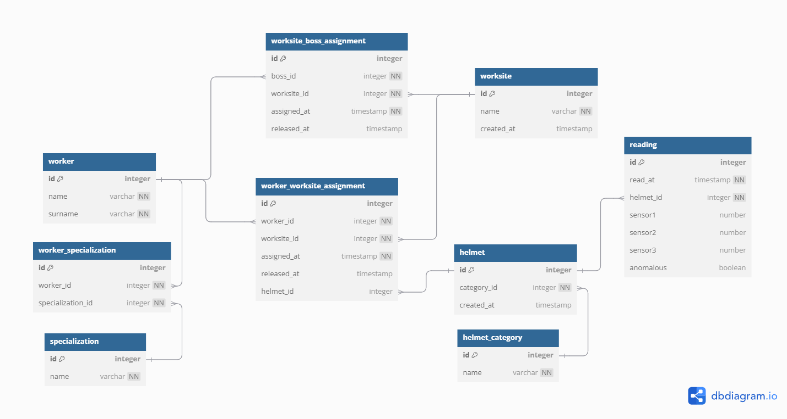

# safeHelmet_db

40 byte ogni 15 minuti per ogni casco

sono 40kb al mese, di letture casco. considerando 10 ore di letture al giorno con 25 giorni di lavoro effettivo al mese

a livello di DB
ogni dato abbiamo 4byte per ogni dato letto da singolo sensore
4x10x4x10x25
quindi sono 40kb ( MASSIMI ) per ogni persona al mese con 10 ore di letture su 25 giorni
